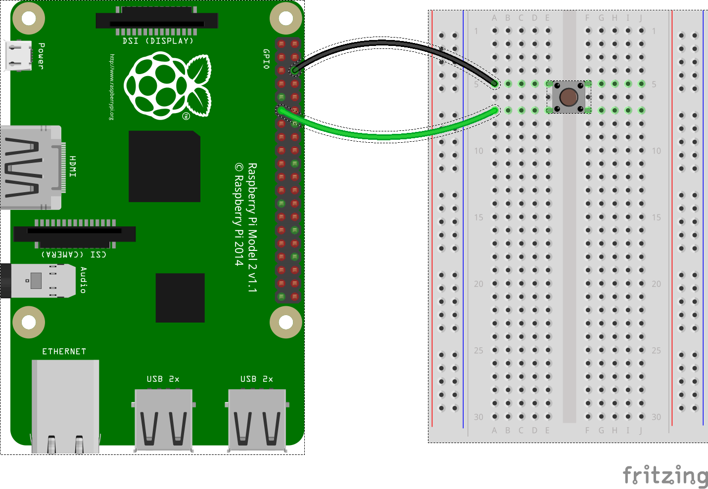

# JoeBox

## Wiring

Note that the button should be connected to pins x17 and 5, as shown:

## Running

* Make sure you have venv installed:
  * `python3 -m pip install --user virtualenv`
* If not done already, create a virtual environment:
  * `python3 -m venv venv`
* Activate the venv:
  * `source venv/bin/activate`
* If not done already, install the dependencies:
  * `pip install -r requirements.txt`
* Run:
  * `python main.py` 
